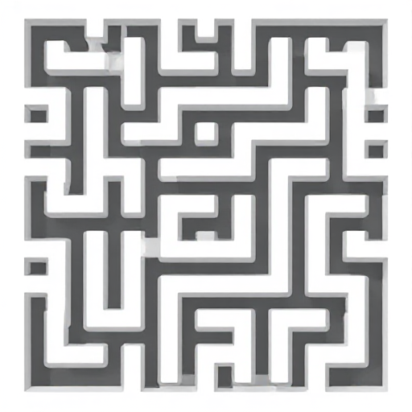

WIP

# Maze Solver


[boot.dev](https://boot.dev) Maze Solver

A python application that builds a maze from scratch using parameters and then solves it. The maze solving is done using [tkinter](https://docs.python.org/3/library/tkinter.html) to provide a visual UI so you can watch the program solve the maze in real time. The maze is constructed and solved using a Depth First Search (DFS) algorithm. This tool does not intend to be the most optimal way to build or solve a maze but rather showcase DFS being used in a real world application.

## How It Works


> [!NOTE]
> If you look at the source code, you may be shocked to see a very high recursion limit being used. This number may need to be increased further for very large mazes. Do not be alarmed, as the DFS recursion that is used to both build and solve the maze runs in O(n) time. Because cells are only visited once, you always selected one of four neighbors, and all work such as animation and drawing is constant, the function runs in linear time.

## Dependencies

Install Tkinter. Most systems should have tkinter pre-installed. You can check with `python3 -m tkinter`. If it is not installed, it is often because the Tk library is missing. You can use this command to install:

```
sudo apt-get install python3-tk
```

or

```
pip install tk
```

## Running the program

To run the program, you can run the main script from the root of the project:

```
./main.sh
```

Or, run the python program directly:

```
python3 src/main.py
```