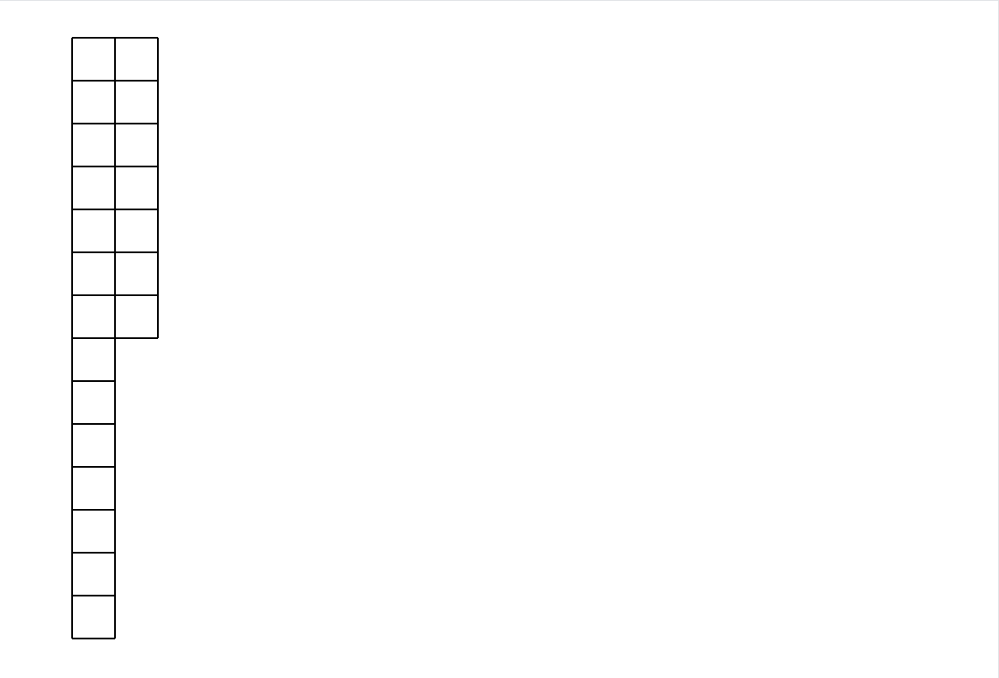

# Maze Solver


[boot.dev](https://boot.dev) Maze Solver

A python application that builds a maze from scratch using parameters and then solves it. The maze solving is done using [tkinter](https://docs.python.org/3/library/tkinter.html) to provide a visual UI so you can watch the program solve the maze in real time. The maze is constructed and solved using a Depth First Search (DFS) algorithm. This tool does not intend to be the most optimal way to build or solve a maze but rather showcase DFS being used in a real world application.

## How It Works



1. The maze class is created via a 2d array of cells. 
2. Each cell is represented by 2 points, which is used to determine the edges and center of each cell.
3. The cell class tracks metadata such as if it has been visited, and what walls have been broken, which is what the algorithms reference.
4. The walls are broken via DFS. One of up to 4 adjacent walls that have not yet been broken are picked from randomly. The function is then called recursively after the wall is broken.
5. The walls are reset such that none of them have been 'visited'
6. The maze is solved via DFS. It will look at each of the 4 directions and see if the wall is broken. If so, it recursively goes down that path, marking lines in gray. The recursive function notably returns a boolean such that if a dead end is reached, lines can be undone, as shown in red.
7. Solved and reversed moves are stored so the maze can be cleared, then the correct solution is replayed in gold.

> [!NOTE]
> You may be shocked to see a very high recursion limit being used. This number may need to be increased further for very large mazes. Do not be alarmed, as the DFS recursion that is used to both build and solve the maze runs in O(n) time. Because cells are only visited once, you always selected one of four neighbors, and all work such as animation and drawing is constant, the function runs in linear time.

## Dependencies

Install Tkinter. Most systems should have tkinter pre-installed. You can check with `python3 -m tkinter`. If it is not installed, it is often because the Tk library is missing. You can use this command to install:

```
sudo apt-get install python3-tk
```

or

```
pip install tk
```

## Running the program

To run the program, you can run the main script from the root of the project:

```
./main.sh
```

Or, run the python program directly, and specify params as needed:

```
python3 src/main.py --width 1200 --height 900 --margin 100 --size 50 --delay 0.01 --seed 0 --max_recursion 100_000
```

You can see all the parameters using the help command:

```
python3 src/main.py --help
```
